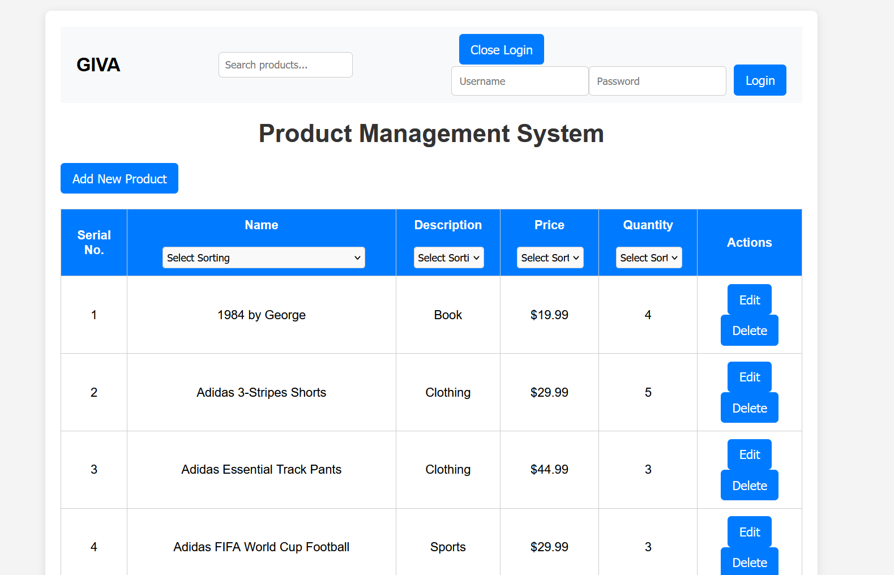

# Product Management System

This project is a Product Management System for managing products in a basic e-commerce setup. It allows users to view, add, edit, and delete products, with basic login based authentication. Built using **React** (Next.js), **Node.js**, and **PostgreSQL**, this application showcases full-stack development with JWT-based authentication and deployment readiness.

## Live Demo

[Live Demo on Vercel](https://e-commerce-silk-iota-15.vercel.app/) (Only frontend is working now, backend is yet to be integrated soon)




## Features

### Frontend
- **Product Listing Page**: View a list of products with details like name, description, price, and quantity.
- **Add Product**: Form to add a new product.
- **Edit Product**: Option to edit an existing product's details.
- **Delete Product**: Option to delete a product from the list.
- **Styling**: Basic CSS and optional Bootstrap integration.

### Backend
- **API Endpoints**:
  - `GET /products`: Fetches all products.
  - `POST /products`: Adds a new product.
  - `PUT /products/:id`: Updates an existing product.
  - `DELETE /products/:id`: Deletes a product.
- **Authentication**: JWT-based authentication for add, edit, and delete operations.

### Database
- PostgreSQL Database with tables:
  - `products`: Stores product information.
  - `users`: Stores user credentials for authentication.

### Optional Features
- **Unit Tests**: API route tests using Jest and Supertest.
- **Deployment**: Hosted on Vercel.

---

## Getting Started

### Prerequisites

- **Node.js** and **npm**
- **PostgreSQL**
- **Git**

### Installation

1. **Clone the Repository**:
   ```
   git clone https://github.com/Shivang004/E-commerce.git
   cd E-commerce
   ```
2. **Install Dependencies**:
- Install app dependencies:
    ```
    npm install
    ```

- Install server-side dependencies:
    ```
    cd my-backend
    npm install
    ```
    ```
    cd..
    npm run build
    ```

3. **Set up PostgreSQL Database**:
- Start PostgreSQL and create a database named product_management.
- Create the products and users tables:
    ```
    CREATE DATABASE product_management;

    \c product_management;

    CREATE TABLE products (
        id SERIAL PRIMARY KEY,
        name TEXT NOT NULL,
        description TEXT,
        price FLOAT NOT NULL,
        quantity INTEGER NOT NULL
    );

    CREATE TABLE users (
        id SERIAL PRIMARY KEY,
        username VARCHAR(50) UNIQUE NOT NULL,
        password TEXT NOT NULL
    );
    ```

4. **Database Variables**:
- Modify the database credentials in my-backend/server.js with the following contents:.
    ```
    const pool = new Pool({
        user: 'postgres',
        host: 'localhost',
        database: 'product_management',
        password: '1234',
        port: 5432,
    });

    ```
- Replace ```<user>``` and ```<password>``` with your PostgreSQL credentials and set a value for JWT_SECRET.

5. **Running the Backend**:
- In the backend directory, start the server:.
    ```
    node server.js
    ```
6. **Running the Frontend**:
- In the frontend directory, start the React application:.
    ```
    npm run dev
    ```
7. **Accessing the Application**:
- Open a browser and go to ```http://localhost:3001``` to view the frontend.
- The backend server is running on ```http://localhost:3000```.

## API Endpoints
**The following API endpoints are available:**
- GET /products - Fetch all products
- POST /products - Add a new product (requires authentication)
- PUT /products/
- Edit an existing product (requires authentication)
- DELETE /products/
- Delete a product (requires authentication)
- POST /auth/login - Log in and receive a JWT token

## Authentication
- Only authenticated users can add, edit, or delete products.
- Use the /auth/login endpoint to log in and receive a JWT token, then include the token in the Authorization header for protected requests.

## Testing
To run tests for the API, run the following command in the backend directory:
    ```
    cd tests
    npm jest
    ```
## Results
 PASS  ./server.test.js
  Product Management API
    √ should fetch all products (8 ms)                                                                                                              
    √ should add a new product (5 ms)                                                                                                               
    √ should not add a product with invalid data (4 ms)                                                                                             
    √ should update a product with valid token (11 ms)                                                                                              
    √ should not update a product without token (6 ms)                                                                                              
    √ should delete a product with valid token (10 ms)                                                                                              
    √ should not delete a product without token (6 ms)                                                                                              
    √ should fail login with incorrect credentials (5 ms)                                                                                           
                                                                                                                                                    
Test Suites: 1 passed, 1 total                                                                                                                      
Tests:       8 passed, 8 total                                                                                                                      
Snapshots:   0 total
Time:        1.388 s, estimated 2 s
Ran all test suites.
